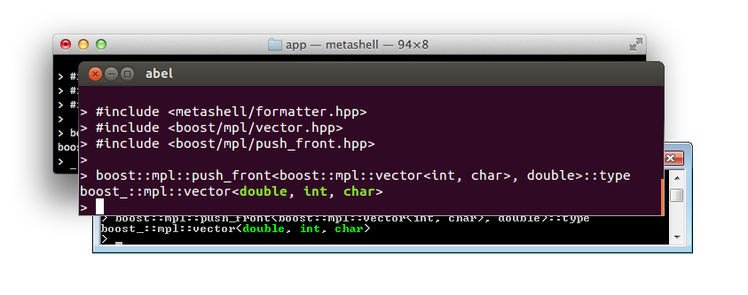

<h1>Metashell</h1>

  
  

The goal of this project is to provide an interactive template metaprogramming
shell.

## Motivation

When one starts learning a new programming language such as Haskell, Python or
Erlang an interactive shell (`python` for Python, `ghci` for Haskell, `erl` for
Erlang) is available for experimenting with the language. Later, after getting
familiar with the language, this shell becomes a tool to try code out, verify
test results or learn more about the problem during debugging.

When one starts learning C++ template metaprogramming, he has to use a C++
compiler which was designed to _compile code_ and not to play with template
tricks. People new to template metaprogramming have to learn how to make the
compiler show them the result of simple metaprograms. This makes it more
difficult to get started with template metaprogramming.

Later, after getting familiar with template metaprogramming, developers have to
use the compiler for testing and debugging. Understanding what is going on in a
template metaprogram during debugging is difficult, since the compiler needs to
be forced to present the result of a metaprogram (or a part of it) - and
compilers are not prepared for this. This extra difficulty in debugging makes
simple problems look difficult.

Metashell provides an interactive shell similar to the Python, Haskell and
Erlang shells for template metaprogramming. It uses Clang to evaluate the
metaprograms.

## License

Metashell is published under the
[GNU General Public License, version 3](http://www.gnu.org/licenses/gpl.html).

&nbsp;

